# Meta-AR-VR.ai

## Introduction
Welcome to Meta-AR-VR.ai, an innovative 3D Metaverse that redefines virtual interactions, conferences, education, and social connectivity. Our platform offers a comprehensive solution for smaller startups and companies seeking to conduct meetings and conferences in a virtual environment, eliminating the need for physical office spaces or conference halls. Meta-AR-VR.ai fosters seamless connections among users, regardless of geographical distances, offering an unparalleled blend of functionality and immersive experiences.

At the heart of Meta-AR-VR.ai lies its advanced features, including a state-of-the-art LLM-powered chatbot that interacts with users through lifelike speech. This chatbot can parse PDF information and provide real-time assistance, enriching the user experience with personalized support. Additionally, everything within the platform is VR-enabled, with audio chat functionality enhancing communication and collaboration.

One of the standout features of Meta-AR-VR.ai is its Virtual Classroom, which revolutionizes online education by providing an interactive 3D learning environment. Students engage with course materials, assignments, and 3D models alongside virtual avatars and educators. Furthermore, a Homework-Helping LLM-powered chatbot augments the learning process, offering personalized assistance with assignments and course materials.

Moreover, Meta-AR-VR.ai features a Blockchain-Powered Theater, offering a unique cinema experience where tickets are secured as NFTs, preventing black marketing and ensuring fair distribution. Users can attend virtual theater screenings and cinema watch parties with friends and family, enjoying movies in VR while maintaining audio chat functionality to interact without disturbing others.

Meta-AR-VR.ai is more than just a virtual environment; it's a dynamic platform that empowers users to connect, collaborate, and learn in entirely new ways. Join us in exploring the endless possibilities of the digital realm.

## Tech Stack
Our platform leverages a diverse array of technologies to deliver immersive experiences and seamless interactions:

- **Three.js**: A lightweight 3D library used for rendering immersive 3D graphics in web browsers.
- **React**: A JavaScript library for building user interfaces, facilitating the development of dynamic and interactive components.
- **Langchain**: A language model technology utilized for natural language processing and dialogue generation.
- **Python**: A versatile programming language employed for various backend and machine learning tasks.
- **Ether.js**: A JavaScript library for interacting with the Ethereum blockchain, enabling seamless integration of blockchain features.
- **GSAP (GreenSock Animation Platform)**: A powerful animation library for creating fluid and engaging animations in web applications.
- **R3F (React Three Fiber)**: A React renderer for Three.js, enhancing the integration of Three.js with React applications.
- **Gemini AI**: An artificial intelligence technology utilized for various tasks within the platform.
- **LLM (Large Language Model)**: Advanced language model technology employed for natural language processing and conversation capabilities.
- **RAG (Retrieval-Augmented Generation)**: An architecture for conversational AI that combines retrieval-based and generative models.
- **Socket.io**: A JavaScript library for real-time bidirectional communication between clients and servers.
- **Drei**: A collection of useful helpers and abstractions for Three.js, enhancing the development process.
- **Jotai**: A state management library for React applications, simplifying the management of application state.
- **ERC-721**: A standard for non-fungible tokens (NFTs) on the Ethereum blockchain, used for tokenizing unique assets.
- **Hardhat**: A development environment for Ethereum smart contracts, facilitating smart contract testing and deployment.
- **Solidity**: The programming language used for writing smart contracts on the Ethereum blockchain.
- **Sepolia**: (Please provide more information if necessary.)
- **Express**: A web application framework for Node.js, used for building RESTful APIs and backend services.
- **Node.js**: A runtime environment for executing JavaScript code outside of a web browser, commonly used for server-side applications.
- **AR.js**: A JavaScript library for building augmented reality (AR) experiences on the web.
- **WebXR**: An API for creating virtual reality (VR) and augmented reality (AR) experiences on the web.
- **FastAPI**: A modern web framework for building APIs with Python, known for its high performance and simplicity.
- **0x0.st**: A file hosting service used for sharing files and resources within the platform.
- **MongoDB**: A NoSQL database used for storing and managing application data.
- **WebRTC**: A web technology for real-time communication between web browsers, facilitating video conferencing and peer-to-peer communication.
- **Peer.js**: A JavaScript library for simplifying WebRTC peer-to-peer data connections.
- **pyttsx3**: A Python library for text-to-speech conversion, enabling speech synthesis within the platform.
- **Remix**: An online integrated development environment (IDE) for Ethereum smart contract development and testing.
- **NFT**: Non-fungible tokens, used for representing ownership of unique digital assets within the platform.
- **VR**: Virtual reality technology, providing immersive 3D environments and experiences.
- **ErsatzTV** : A platform for hosting and streaming virtual theater screenings and cinema experiences.
- **Jellyfin** : A free and open-source media server software, facilitating the hosting and streaming of media content within the platform.

## About the Project
Meta-AR-VR.ai offers a diverse range of functionalities tailored to various use cases:

### VR Meeting Room
The VR Meeting Room offers a professional virtual environment for conducting meetings and presentations. Users can upload PDF presentations and interact with 3D models to showcase prototypes or ideas. Real-time doubt support ensures a smooth meeting experience, while the immersive VR setting provides a sense of presence and engagement.

### Conference Hall
The Conference

 Hall is designed to accommodate large-scale events and conferences with up to 500 attendees. It features a big screen for sharing information and presentations to all participants simultaneously. Presenters can showcase 3D models for educational purposes, and the entire hall is VR-enabled with audio chat support for seamless communication.

### Virtual Classroom
The Virtual Classroom transforms online education by offering an immersive 3D learning environment. Students engage with course materials, assignments, and 3D models alongside virtual avatars and educators. Furthermore, a Homework-Helping LLM-powered chatbot augments the learning process, offering personalized assistance with assignments and course materials.

### Blockchain-Powered Theater
The Blockchain-Powered Theater offers a unique cinema experience where tickets are secured as NFTs, preventing black marketing and ensuring fair distribution. Users can attend virtual theater screenings and cinema watch parties with friends and family, enjoying movies in VR while maintaining audio chat functionality to interact without disturbing others.

## Features
- Virtual meeting rooms with PDF presentation support and real-time doubt resolution.
- Conference halls for large-scale events with 3D model showcasing and AR compatibility.
- Virtual classrooms with interactive 3D models, assignments, and real-time support.
- Blockchain-powered theater for immersive movie experiences and watch parties.

## Contributions
We welcome contributions from developers, designers, and creators to enhance the functionality and user experience of Meta-AR-VR.ai. Please refer to our contribution guidelines for more information.

## Images

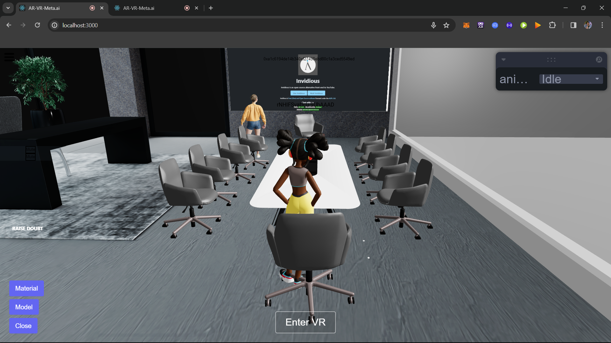 

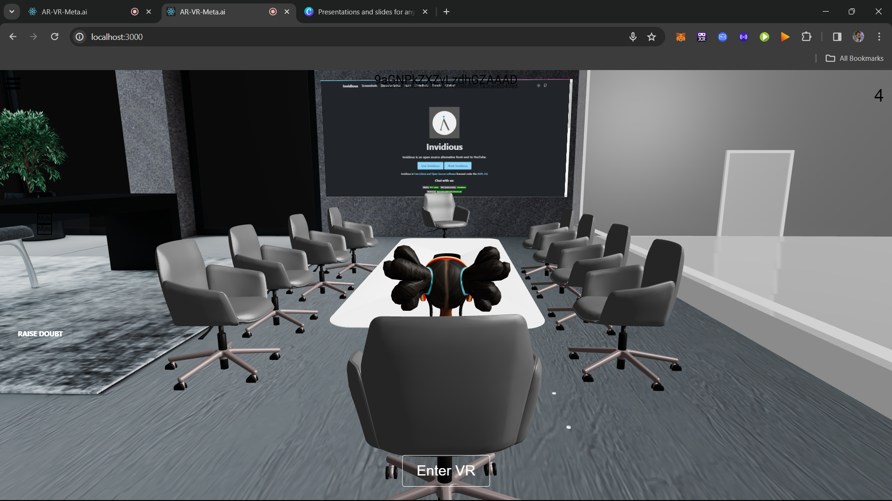

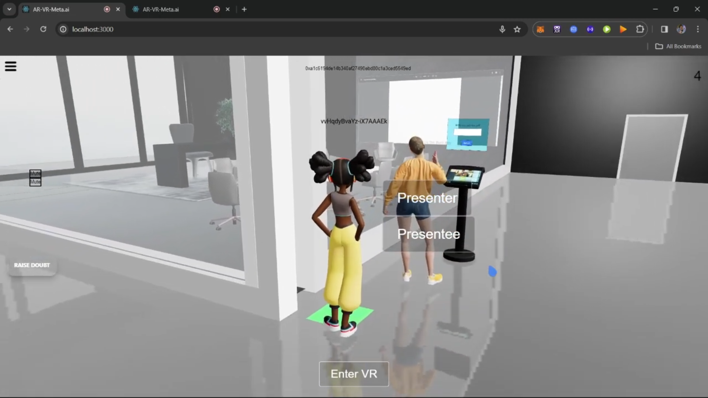

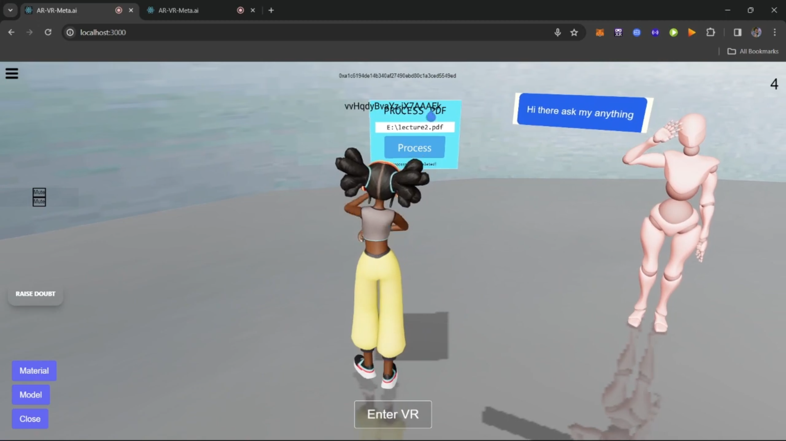

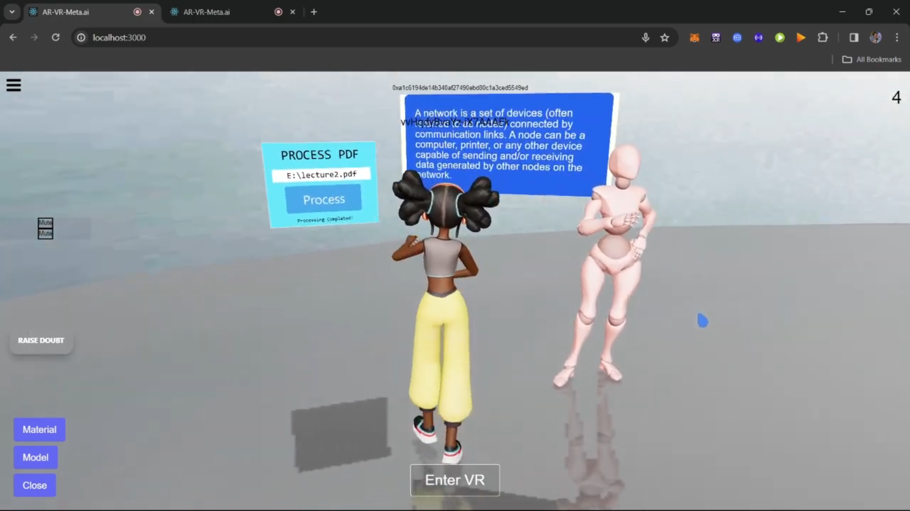

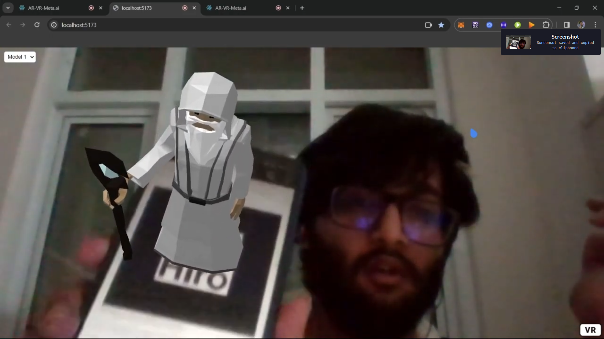

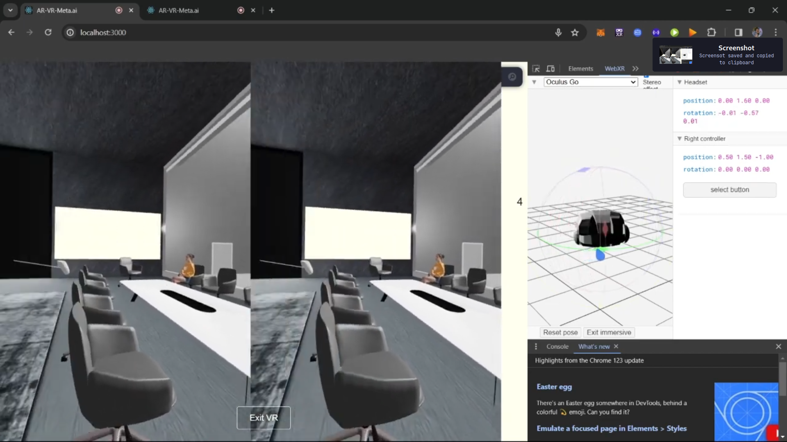

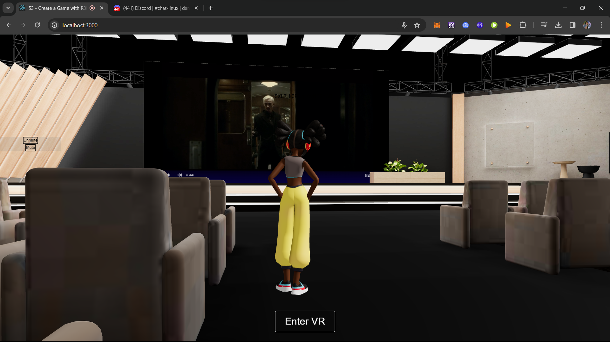

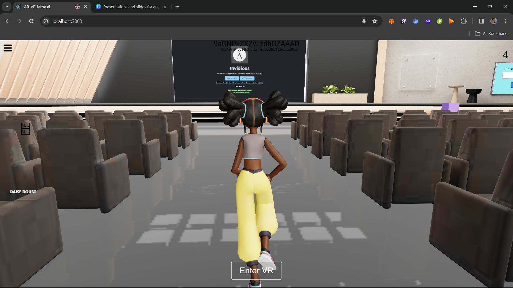

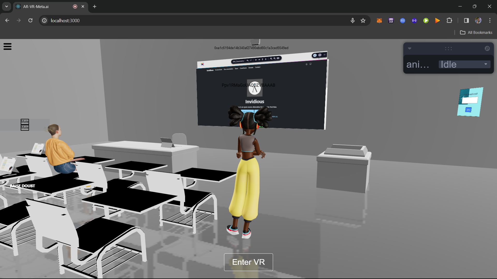

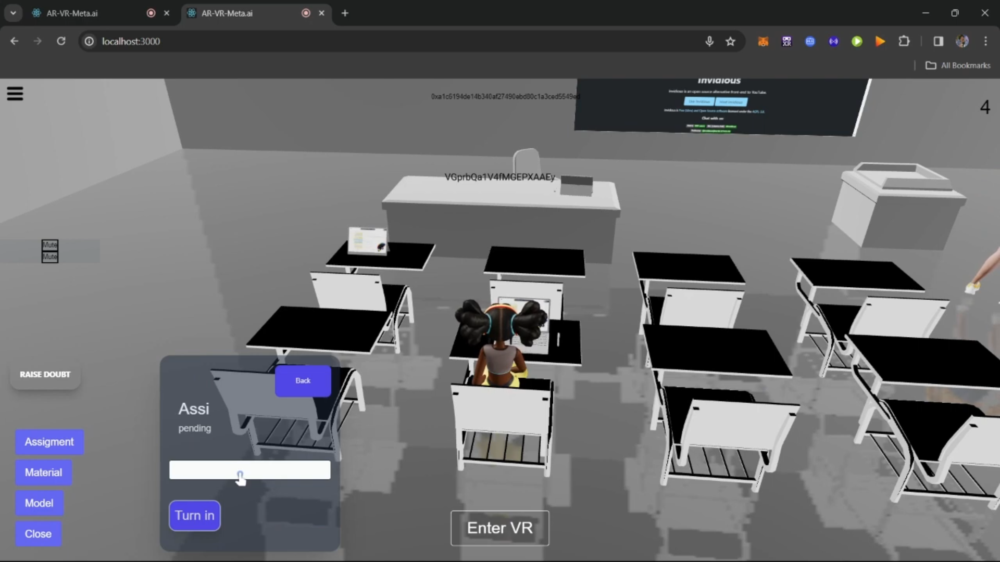

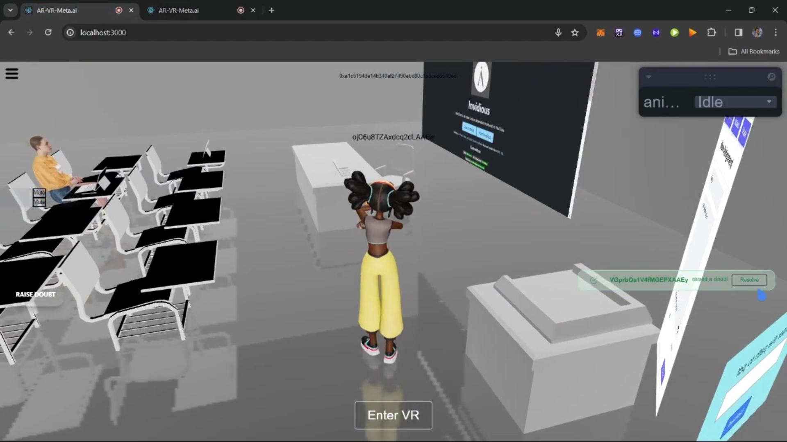

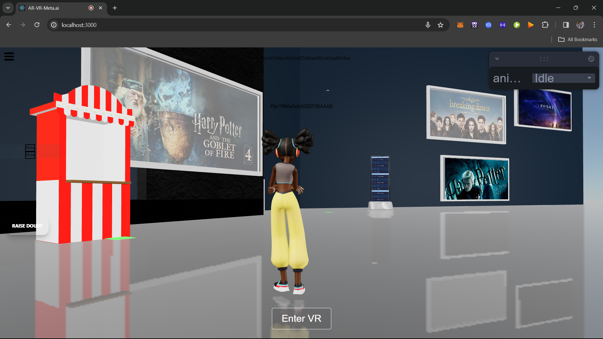

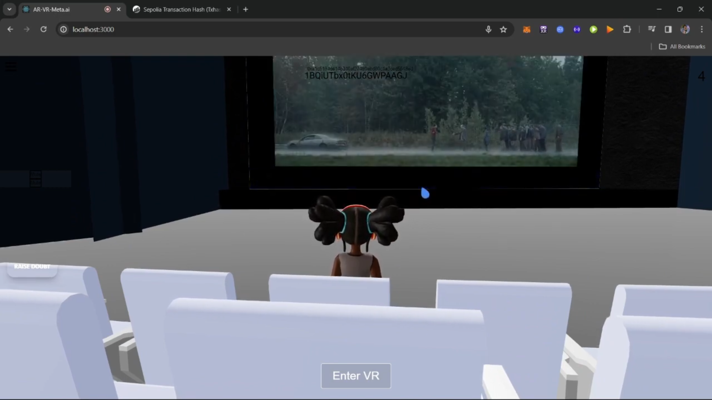

## video

## Contract address
 0xD663f267A074CE8A3580872DbD953981F4d83029
https://sepolia.etherscan.io/address/0xd663f267a074ce8a3580872dbd953981f4d83029
## License
Meta-AR-VR.ai is licensed under the MIT License. See the LICENSE file for details.

